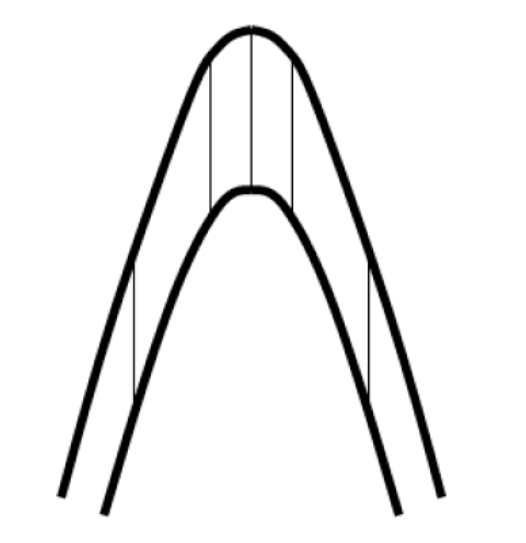

# 中海油地层结构建模项目文档

## 项目背景

测井技术作为地下地质信息获取的核心手段，通过井孔内岩石物理参数（如电阻率、声波速度、放射性等）的精密测量，为油气勘探、地质构造解析及水文工程提供了关键数据支撑。现代井壁成像仪器（如FMI、UBI、声电成像仪）已能对井周地层进行可视化扫描，精准识别层理、裂缝及溶蚀孔洞等微观结构，并生成包含岩层产状（倾向、倾角、走向）的高分辨率数据。然而，传统建模方法依赖的离散化井周局部信息仅能反映井眼附近的构造特征，无法准确预测地层的延伸规律。尤其在挤压或伸展构造区（如褶皱转折端），基于平行层假设的建模方法因忽略地层厚度变化、岩层旋转等动态特征，导致储层几何形态误差增大，严重制约复杂构造区的资源评价精度。针对上述问题，本项目提出一种基于蛛网算法的新型建模框架，构建符合地质力学规律的地质模型，为复杂构造区的资源勘探与开发提供高精度地质模型支撑。

## 预备知识

### 地层构造
1. 褶皱构造
   1. 褶皱构造是岩层在构造应力（如挤压）作用下发生的弯曲变形。反映区域水平挤压作用，常见于造山带，是油气储集的重要构造。

   2. 分类：

      - 背斜（Anticline）：岩层向上拱起，核心部位为老地层。

      - 向斜（Syncline）：岩层向下弯曲，核心部位为新地层。

      - 单斜（Monocline）：岩层向单一方向倾斜的平缓弯曲。
    
    
   3. 相似褶皱和平行褶皱
      - **相似褶皱**（similar fold）是一种褶皱几何模式，褶皱中各岩层成相似弯曲，即其曲率半径大致相等，但没有共同的曲率中心，故褶皱形态在一定深度内保持不变。同一岩层的真厚度在翼部变薄、在转折端加厚,但顺轴面方向的视厚度在褶皱的不同部位大致相等（图中不同部位黑色竖线大致相等）。
      
      - **平行褶皱**（parallel fold）是一种褶皱几何模式。组成褶皱的各褶皱面作平行弯曲，同一褶皱层的厚度保持不变，所以也称为等厚褶皱（isopach fold）；弯曲的各层具有同一曲率中心，所以又称同心褶皱（concentric fold）（图中与层面线垂直的黑色竖线大致相等）。
      

2. 断层构造
   1. 岩层因构造应力发生破裂并沿破裂面发生明显位移。
   2. 分类：
      - 正断层（Normal Fault）：受拉张力作用，上盘相对下降。
      - 逆断层（Reverse Fault）：受挤压力作用，上盘相对上升。
      - 走滑断层（Strike-Slip Fault）：两盘沿断层走向水平滑动。
   
   3. 描述断层的要素：
      - 断盘：断层面两侧发生相对位移的岩体，称为断（层）盘。当断层面倾斜时，位于断层面上方的称为上盘，下方的称为下盘；当断层面近于直立时，则以方位相称，如东盘、西盘等；也可根据两盘相对移动的关系，把相对上升的称为上升盘，把相对下降的称为下降盘。
      - 断距：断层两盘岩体沿断层面发生相对滑动的距离。断距的大小常常是衡量断层规模的重要标志，断距又分为总断距（地层断距）、水平地层断距及垂（铅）直地层断距。
   
   

  - [x] 这一节主要讲一下主要有哪些种地层构造，单斜、平行褶皱、拖曳褶皱、断层等等，都可以配上图讲一下（markdown有加图片的语法）

### 岩层产状

岩层产状是指即岩层的产出状态，由地层倾角、走向和倾向构成岩层在空间产出的状态和方位的总称。现有的测井工具可以直接得到各个深度的岩层产状以及井斜数据，其中：

- 地层倾角：层面上的倾斜线和它在水平面上投影的夹角，称倾角，又称真倾角(下图中的α均表示真倾角)；倾角的大小表示岩层的倾斜程度。视倾斜线和它在水平面上投影的夹角，称视倾角(γ)。真倾角只有一个，而视倾角可有无数个，任何一个视倾角都小于该层面的真倾角。
设ABCD 为地层层面，ABEF 为水平面，AB、CD 为走向线，AFD 面为与走向垂直的断面。

- 方位角：方位角，又称地平经度(Azimuth angle，缩写为Az)，是在平面上量度物体之间的角度差的方法之一。是从某点的指北方向线起，依顺时针方向到目标方向线之间的水平夹角。（以太阳为例）

- 走向：岩层层面与任一假想水平面的交线称走向线，也就是同一层面上等高两点的连线；走向线两端延伸的方向称岩层的走向，岩层的走向也有两个方向，彼此相差180°，通常用小于180°的方位角表示。岩层的走向表示岩层在空间的水平延伸方向。
- 倾向：层面上与走向线垂直并沿斜面向下所引的直线叫倾斜线，它表示岩层的最大坡度；倾斜线在水平面上的投影所指示的方向称岩层的倾向，又叫真倾向，真倾向只有一个，倾向表示岩层向哪个方向倾斜。

- 井轨迹水平投影：将钻井轨迹投影到水平面上。

- 井斜角（α表示）：井斜角是钻井专业术语，又叫井斜，通常定义为井眼轴线上某点的切线与铅垂线的夹角。
- 井斜方位角（β表示）：井眼轴线的切线在水平投影面上的方向。以正北方向线为始边顺时针转至该水平投影线之间所夹的角度来表示。

- [x] 然后详细地配图讲一下什么是地层倾角、走向、倾向、方位角、井斜都详细讲一下，配个图。

### 立体图（吴氏图）
配图详细介绍一下吴氏图，以及各种地层构造会在吴氏图上出现什么样的特征。

### 构造轴线与构造剖面

介绍一下什么是构造轴线，然后针对各种地层构造该如何计算出构造轴线，这里尽可能先多写几个地层构造吧，后续也可以让杨博士看看我们写的对不对，这里写的时候稍微都带一下数学的符号，比如切向量就可以写作$\mathbf{\beta} = (\beta_0,\beta_1,\beta_2)$，不要粗略地就说两个切向量可以定义一个平面，具体结果还是可以用数学符号表达一下的。

二维构造剖面为地质体内部​​构造特征​​、​​岩性分布​​及​​地质事件序列​​的图解模型（这里我是deepseek了一下，可以补充补充），与构造轴线相垂直。

### 蛛网法

蛛网法可以根据给定岩层产状和构造轴线来生成二维构造剖面，其主要步骤分为以下几步： （论文中的那几步，我记得文中四步之后下面两段也是要做的步骤，配上那个图都一起写一下，其实也就是把那个6a-6j步骤都描述一下）

## 项目契约

输入数据：
- 一份垂直井的测井数据，其中包括以下几列DEPT（垂深），DEVI（井斜角），DPAZ（地层倾角倾向），DPTR（地层倾角角度），HAZI（水平方位角）， **还有一个TYPE(我忘了具体名字了，表示是什么地层构造的那个)**。
- 用户自定义的构造轴线，若缺省则默认由程序计算构造轴线。
输出数据：
- 二维地质剖面图。

## 技术路线

（这里我是写了个大概，你再多补充一下）

算法主要分为以下四步：
1. 数据过滤：对地层倾角进行平滑处理，过滤掉急剧变化的倾角，比如和前后倾角相差超过5度的倾角数据。
2. 分区和模型选择： 根据立体网的模式进行区域划分，针对不同区域依照其特征选取不同的地层构造模型。
3. 确定构造轴线和剖面所在平面：见预备知识。
4. 将地层倾角投影到二维平面，再用蛛网法生成二维构造剖面：（这里要讲一下怎样把地层倾角投影到二维平面）