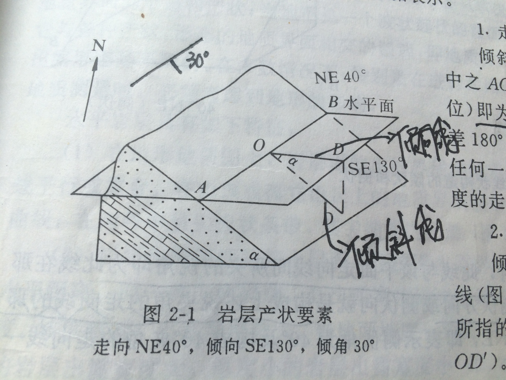

# 中海油地层结构建模项目文档

## 项目背景

测井技术作为地下地质信息获取的核心手段，通过井孔内岩石物理参数（如电阻率、声波速度、放射性等）的精密测量，为油气勘探、地质构造解析及水文工程提供了关键数据支撑。现代井壁成像仪器（如FMI、UBI、声电成像仪）已能对井周地层进行可视化扫描，精准识别层理、裂缝及溶蚀孔洞等微观结构，并生成包含岩层产状（倾向、倾角、走向）的高分辨率数据。然而，传统建模方法依赖的离散化井周局部信息仅能反映井眼附近的构造特征，无法准确预测地层的延伸规律。尤其在挤压或伸展构造区（如褶皱转折端），基于平行层假设的建模方法因忽略地层厚度变化、岩层旋转等动态特征，导致储层几何形态误差增大，严重制约复杂构造区的资源评价精度。针对上述问题，本项目提出一种基于蛛网算法的新型建模框架，构建符合地质力学规律的地质模型，为复杂构造区的资源勘探与开发提供高精度地质模型支撑。

## 预备知识

### 地层及地层构造

**加一下地层的概念**
### 地层 
1. 地层概念
   地层指的是地球历史中某一地质时期形成的、具有共同特征或成因的层状岩石或沉积物。简单来说，就是一层一层叠起来的岩石“书页”，记录了地球的演变历史。
2. 地层年代表
   地质学中用于划分和描述地球历史中形成的具体岩层序列的时间框架。以岩层单位（宇、界、系、统、阶）划分地球表面堆积的实体岩石序列，关注物质记录。
   
### 地层构造
1. 褶皱构造
   1. 褶皱构造是岩层在构造应力（如挤压）作用下发生的弯曲变形。反映区域水平挤压作用，常见于造山带，是油气储集的重要构造。

   2. 分类：

      - 背斜（Anticline）：岩层向上拱起，核心部位为老地层。

      - 向斜（Syncline）：岩层向下弯曲，核心部位为新地层。

      - 单斜（Monocline）：岩层向单一方向倾斜的平缓弯曲。
    
    
   3. 相似褶皱和平行褶皱
      - **相似褶皱**（similar fold）是一种褶皱几何模式，褶皱中各岩层成相似弯曲，即其曲率半径大致相等，但没有共同的曲率中心，故褶皱形态在一定深度内保持不变。同一岩层的真厚度在翼部变薄、在转折端加厚,但顺轴面方向的视厚度在褶皱的不同部位大致相等（图中不同部位黑色竖线大致相等）。
      
      - **平行褶皱**（parallel fold）是一种褶皱几何模式。组成褶皱的各褶皱面作平行弯曲，同一褶皱层的厚度保持不变，所以也称为等厚褶皱（isopach fold）；弯曲的各层具有同一曲率中心，所以又称同心褶皱（concentric fold）（图中与层面线垂直的黑色竖线大致相等）。
      

2. 断层构造
   1. 岩层因构造应力发生破裂并沿破裂面发生明显位移。
   2. 分类：
      - 正断层（Normal Fault）：受拉张力作用，上盘相对下降。
      - 逆断层（Reverse Fault）：受挤压力作用，上盘相对上升。
      - 走滑断层（Strike-Slip Fault）：两盘沿断层走向水平滑动。
   
   3. 描述断层的要素：
      - 断盘：断层面两侧发生相对位移的岩体，称为断（层）盘。当断层面倾斜时，位于断层面上方的称为上盘，下方的称为下盘；当断层面近于直立时，则以方位相称，如东盘、西盘等；也可根据两盘相对移动的关系，把相对上升的称为上升盘，把相对下降的称为下降盘。
      - 断距：断层两盘岩体沿断层面发生相对滑动的距离。断距的大小常常是衡量断层规模的重要标志，断距又分为总断距（地层断距）、水平地层断距及垂（铅）直地层断距。
   
   
   4. 断层破碎带：
      1. 概念
      指的是沿着断层线两侧，由于断层活动（尤其是多次活动）而遭受强烈挤压、剪切、研磨和碎裂破坏所形成的一个相对较宽的、岩石结构被显著破坏的地带。简单来说，可以把它想象成断层“受伤”最严重的核心区域。
      2. 成因
      - 断层活动： 当断层两侧的岩块发生相对滑动（无论是正断层、逆断层还是走滑断层）时，接触面附近的岩石会承受巨大的压力和剪切力。
      - 岩石破碎： 这些强大的应力超过了岩石的强度极限，导致岩石发生破裂、碎裂、研磨和变形。
      - 多次活动： 断层通常是长期、多次活动的。每次活动都会对已破碎的岩石进行再次破坏和改造，使得破碎带逐渐加宽，内部结构更加复杂。
      3. 特征
      - 宽度变化大： 破碎带的宽度可以从几厘米、几米到几十米甚至数公里不等，这取决于断层的规模、活动强度、活动次数、岩石性质以及所处的深度等因素。大型区域性断层的破碎带通常很宽。
      - 次级断层和裂隙： 破碎带内常包含多条与主断层平行或斜交的次级小断层和密集的节理、裂隙。
      4. 直观解释
      想象两块木板相互摩擦滑动，在接触面附近会产生大量的木屑和碎块，这个木屑碎块集中的区域就类似于断层破碎带。地质上的过程要复杂得多，力量也大得多，形成的破碎带也更宽、更复杂。
      5. 产状（详见岩层产状章节）特点
      -  总体与主断层一致：断层破碎带是沿着主断层面及其附近发育的，因此其走向和倾向在宏观尺度上通常与主断层的走向和倾向基本平行或一致。
      -  产状相对不稳定，变化较大：由于破碎带内部岩石遭受了强烈的挤压、剪切、碎裂和多期次活动改造，其边界往往不清晰、不规则、呈锯齿状或波状起伏，导致其产状测量存在不确定性。且局部产状多变，在破碎带内部较小的尺度上，其产状可能与主断层的总体产状存在显著偏差。可能更陡、更缓、甚至倾向相反。
      -  沿走向/倾向的渐变： 破碎带的宽度、内部结构以及局部产状会沿着断层的走向和倾向发生变化。例如，在断层弯曲（拐点）处、分支断层交汇处、不同岩性接触带附近，破碎带的产状变化可能更剧烈。
      

### 岩层产状

岩层产状是指即岩层的产出状态，由地层倾角、走向和倾向构成岩层在空间产出的状态和方位的总称。现有的测井工具可以直接得到各个深度的岩层产状以及井斜数据，其中：

- 地层倾角：层面上的倾斜线和它在水平面上投影的夹角，称倾角，又称真倾角(下图中的α均表示真倾角)；倾角的大小表示岩层的倾斜程度。视倾斜线和它在水平面上投影的夹角，称视倾角(γ)。真倾角只有一个，而视倾角可有无数个，任何一个视倾角都小于该层面的真倾角。
设ABCD 为地层层面，ABEF 为水平面，AB、CD 为走向线，AFD 面为与走向垂直的断面。

- 方位角：方位角，又称地平经度(Azimuth angle，缩写为Az)，是在平面上量度物体之间的角度差的方法之一。是从某点的指北方向线起，依顺时针方向到目标方向线之间的水平夹角。（以太阳为例）

- 方位角表示法：一般记录倾向和倾角 ，如SW205°∠65°，即倾向为南西205°，倾角65°，其走向则为NW295°或SE115°（通常取115°）。

- 走向：岩层层面与任一假想水平面的交线称走向线，也就是同一层面上等高两点的连线；走向线两端延伸的方向称岩层的走向，岩层的走向也有两个方向，彼此相差180°。岩层的走向表示岩层在空间的水平延伸方向。

- 倾向：层面上与走向线垂直并沿斜面向下所引的直线叫倾斜线，它表示岩层的最大坡度；倾斜线在水平面上的投影所指示的方向称岩层的倾向，又叫真倾向，真倾向只有一个，倾向表示岩层向哪个方向倾斜。

- 井轨迹水平投影：将钻井轨迹投影到水平面上。

- 井斜角（α表示）：井斜角是钻井专业术语，又叫井斜，通常定义为井眼轴线上某点的切线与铅垂线的夹角。
- 井斜方位角（β表示）：井眼轴线的切线在水平投影面上的方向。以正北方向线为始边顺时针转至该水平投影线之间所夹的角度来表示。

### 地质和地质分层

**讲述一下地质的概念以及地质分层如何导致的地层分层**
1. 地质概念
   地质泛指地球的性质和特征。主要是指地球的物质组成、结构、构造、发育历史等，包括地球的圈层分异、物理性质、化学性质、岩石性质、矿物成分、岩层和岩体的产出状态、接触关系，地球的构造发育史、生物进化史、气候变迁史，以及矿产资源的赋存状况和分布规律等。
2. 地质时期
   地质时期是地质学中用来描述地球漫长历史的时间单位，它代表了地球演化过程中不同的、通常以百万年甚至亿年为尺度的阶段，可用地质年代表来表示。
3. 地层单位符号简写表(同一符号代表同一地质时期沉积的地层)
   1. 系（System）的符号（最常用）：
      寒武系： Є（特殊符号）或 Cm
      奥陶系： O
      志留系： S
      泥盆系： D
      石炭系： C
      二叠系： P
      三叠系： T
      侏罗系： J
      白垩系： K（源自德语 Kreide）
      古近系： Pg（原第三系下部）
      新近系： Ng（原第三系上部）
      第四系： Q
   2. 统（Series）的符号，用下标数字表示分层：
      1 = 下统（Lower） → 如 O₁（下奥陶统）
      2 = 中统（Middle）→ 如 J₂（中侏罗统）
      3 = 上统（Upper） → 如 D₃（上泥盆统）

4. 地层分层
   指的是地球表层（主要是岩石圈上部）的层状岩石（沉积岩、火山岩等）按照其形成的时间顺序、岩性特征、古生物化石、接触关系等进行的划分，地层年代是核心依据。（例如：两套相邻地层分别是三叠系地层和侏罗系地层）
5. 地质分层和地层分层的关系
   地质分层是更广义的概念，包含但不限于地层分层，它可以指地层分层本身，地球内部圈层结构（行星科学领域），特定区域或工程场地的综合分层（工程勘察领域）。通常当人们说“地质分层”时，在基础地质研究、地层学领域，通常就等同于地层分层，二者都是地质单元划分的一种概念。

### 极射赤平投影
极射赤平投影是一种以球面投影为基础的几何方法，通过将三维空间中的方向、平面或线投影到一个参考平面（通常为赤道平面），形成二维图形，保留原始结构的空间关系。
在未说明的情况下默认使用上级射点发出射线，例如下图中线PB投影到赤平面上为B'，将倾斜面NBSA与球面的无数个交点与P点连城直线并投影到赤平面得到弧线NB'S

### 吴氏网
吴氏网是一种基于等角极射赤平投影的网格工具，用于将三维空间中的方向、平面和线投影到二维平面上，同时保持原始角度关系不变。A图吴氏网的经线可以用下图B的下半圆球面与过圆心的倾斜大圆（倾斜面）的交点形成的直线投影在赤平面（图B中的半球切面）投出的无数个点形成弧线得到，同理，吴氏网的纬线可由下半圆球面与不过圆心的直立小圆的交点形成的直线投影在赤平面投出的无数个点形成弧线得到。之后，从N向顺时针360°标方位。
经线弧NES到弧NS之间的一系列弧线分别表示倾斜平面倾角0度到90度，经线弧NWS到弧NS之间的一系列弧线也分别表示倾斜平面倾角0度到90度。

### 利用吴氏网进行极射赤平投影
倾斜面NDS与倾斜面法线（法向量）OF的极射赤平投影示例：法线OF投影到赤平面上得到该倾斜面NSD的极点F'，平面法线的投影示例如下图，D'E表示倾斜面倾角大小40°（B图弧ND'S对应吴氏网40°经线）,同理WF'表示法线倾角大小为50°（WE处的纬线与50°经线交点）：

### 施密特网
1. 等积投影原理（兰伯特等积投影法）
   考虑一个单位球体（半径 R = 1），其球心位于坐标原点 O(0, 0, 0)，球面方程为 x² + y² + z² = 1。为便于投影定义，引入一个辅助球体，其球心位于 (0, 0, 1)，球面方程为 x² + y² + (z - 1)² = 1，并与单位球体在点 O(0, 0, 0) 相切。

   投影平面与参考平面： 等面积投影的目标平面为 XY 平面 (z = 0)，投影中心位于切点 O。

   中央经线平面： 平面 HAOE-H (即 XZ 平面，y = 0) 定义为中央经线平面。

   赤道平面： 平面 FAGE-F (即 XY 平面，z = 0) 定义为赤道平面。

   半球选择： 在地质构造产状分析中，通常采用下半球投影（对应于 z ≤ 0 的单位球体部分），以符合“地质构造主要位于地下”的常规表示。

   平面投影的构建：

   设球面上存在五点 A、B、C、D、E，共同定义一个平面 ABCDE。欲求该平面在施密特网上的投影（即其大圆轨迹），需遵循以下几何原理：

   球极： 对于辅助球体 x² + y² + (z - 1)² = 1，其北极位于球极 S(0, 0, 2)（原文 z 轴方向）。

   大圆平面： 连接球极 S 与球面上任意点 P (如 A, B, C, D, E) 的直线 SP 必然穿过坐标原点 O。包含点 S、O、P 的平面与辅助球体相交，其交线为一大圆的一部分。

   投影点生成： 对于点 P，其投影点 P' 位于该大圆平面与投影平面 (XY 平面，z = 0) 的交线上。具体地，在辅助球体的大圆平面内，以 O 为圆心，以距离 r = 2R sin(c / 2) 为半径（R = 1 为单位球体半径，c 为直线 OP 与辅助球体球极轴 SO 的夹角），作圆弧交 XY 平面于 P'。此即点 P 在施密特网上的投影位置。

   大圆投影轨迹： 对平面 ABCDE 上的所有点重复上述过程（步骤 3）。当在球面大圆弧 ABCDE 上采样足够多的点并投影时，其投影点集 A', B', C', D', E', ... 将在投影平面上形成一条光滑曲线，该曲线即为平面 ABCDE 的等面积投影（大圆）。

   投影性质与实例分析：

   轨迹完整性： 在示例中，曲线 A'B'C'D'E' 是平面 ABCDE 在下半球投影的完整大圆轨迹。未连接 E' 与 A' 的原因是：当考虑包含点 A、O、E 的半大圆平面 AOE 时，其投影点 A' 和 E' 位于中央经线平面 (x 轴) 上，点 O 投影为其自身。因此，该半大圆的投影为直线段 A'OE'。然而，在完整的平面 ABCDE 投影中，线段 E'A' 是半大圆 AOE 投影的一部分，而曲线段 A'B'C'D'E' 是另一部分 (ABCDE) 的投影，二者共同构成完整的闭合大圆投影轨迹。故在绘制平面 ABCDE 的投影时，曲线段 A'B'C'D'E' 已包含其所有边界点，无需额外连接 E' 与 A'（该连接线已隐含在中央经线投影中）。

   等面积性： 等面积投影（施密特网）的核心特性是面积守恒。该性质体现为：球面上任意区域的面积与其在投影平面上对应区域的面积相等。

   示例 1 (曲面)： 球面上由曲线 ABCDE 和 AOE 围成的曲面区域 ABCDE-OA，其投影为平面区域 A'B'C'D'E'-OA'。根据等面积投影定义，曲面 ABCDE-OA 的面积等于其投影区域 A'B'C'D'E'-OA' 的面积。

   示例 2 (半球)： 整个下半球面 FAGE-O 的等面积投影是投影平面上的一个圆盘 F'A'G'E'，其圆心位于 O，半径对应于投影公式 r = 2R sin(90° / 2) = 2R sin(45°) = √2 (当 R=1)。该圆盘的面积 (π * (√2)² = 2π) 等于下半球面的面积 (2πR² = 2π，当 R=1)，严格满足面积守恒。

   所以我们可以做出如下通俗推论：赤道方位等积投影等效于将单位球体“下半球” $x^2 + y^2 + (z-1)^2 = 1\  (z \leq 1)$ 均匀地拍打在平面XOY上
   
2. 施密特网读取
   如下图所示，其中所有连接南北两极的曲线段和直线段都是网图的大圆（great circle，下图红色曲线段表示），可以理解成施密特网图的“经线”；连接南北两极的直线段称为中央经线。此外，连接东西两极的直线段，即施密特网图的“赤道”，也是大圆。所有除赤道的东西走向曲线段称作施密特网图的小圆（small circle，下图蓝色曲线段表示），可以理解成网图的“纬线”。
   此外，在使用施密特网图进行产状分析时有三条惯例：
   1）所有面状构造在网图上都是大圆；
   2）所有线状构造穿过球心；
   3）涉及圆锥底面的投影时，锥体顶点在球心。
3. 读取步骤:
   1. 识别大圆：
      在施密特网上找到代表你要分析的面状构造的那条大圆弧。它应该是一条从基圆一侧延伸到另一侧的平滑曲线。
   2. 确定走向：
      - 走向线： 大圆弧与施密特网基圆（外圆）相交于两点。连接这两点的直线（或更准确地说，过这两点和投影球球心的平面）代表了该平面的走向线。
      - 读取走向值： 在施密特网的基圆上读取其中一个交点的方位角（0°-360°）。这个读数就是该平面的走向。
   3. 确定倾向：
      - 倾向方向： 走向确定后，倾向方向必然垂直于走向。你需要确定平面是向哪个方向倾斜的（即倾向方位）。
      - 大圆弧的“下凹”点： 在施密特网上，大圆弧总是向圆心方向“下凹”。这个“下凹”的最深处（即大圆弧上离基圆最远的点，或者说最靠近投影网中心的点）所指的方向，就是该平面的倾向方向。
      - 读取倾向值：
      找到大圆弧上离圆心最近的那个点（即“下凹”顶点）。
      想象一条从投影网中心（O点） 指向这个“下凹”顶点的直线。
      将这条直线向外延伸，与基圆相交于一点。
      在基圆上读取这个交点的方位角（0°-360°）。这个读数就是该平面的倾向。
   4. 确定倾角
      给出网格线与吴尔夫网的读取方法同理。
      若未给出网格线可根据公式$r = 2Rsin(c / 2)$求出c，倾角就是90°-c
   
4. 施密特网与构造分析
   1. 单斜可近似看成一个平面在施密特网中投影为经线大圆弧。
   2. 褶皱可以分为圆柱形褶皱和圆锥形褶皱，圆柱形褶皱如[图20]A中所示，在施密特网中其两翼切面法线可拟合为经线大圆弧形成投影平面（π圆面）。
   3. 圆锥形褶皱如下图所示，褶曲形面所构成的部分锥体叫 S 锥。锥体的旋转轴为锥轴（K），不位于形面上，在各个包含该轴的平面上，形面迹线与 K 间夹角（即半顶角 φ）相等。各个包含 K 的平面与形面交线称为脊线，只有相当于褶轴面的那个平面同形面的交线才被称为褶轴，顺褶轴方向，形面曲率向锥顶逐渐增大。在施密特网上，包含锥轴 K 的平面是不同倾斜方位和倾角的投影大圆，脊线投影点 \(d_1\)、\(d_2\) 等均分布于一个投影小圆上或附近，小圆半径角距为 \(\phi\)，显然，形面的\(\pi\)点必位于另一个圆锥上，这即是\(\pi S\)锥；可由\(d_1\)、\(d_2\) 等点分别取 \(90^\circ\) 的角距得出各点的连线而求出其投影。可以看出 S 锥与\(\pi S\)锥为共锥轴的两个锥体，但\(\pi S\)锥之半顶角为\(90^\circ\)-\(\phi\)。锥轴K是圆锥褶皱的构造轴线，投影平面是与轴K垂直的平面，也就是圆锥褶皱各切面法向量得到的直立小圆面（\(\pi S\)锥底面）
   
   

### 极等面积网（施密特极点网）
1. 投影原理（兰伯特等积投影法）
   一个半径为1的单位球体，由式子 $x^2 + y^2 + (z-1)^2 = 1$定义，其中平面HAOE-H，位于XOZ平面上且垂直于y轴，平面FAGE-F构成赤道平面，平行于XY平面上且垂直于z轴。一般地，这个球体的等积投影位于XOY平面上，且相切于点O。在产状分析中我们一般使用“上半球”，即$z\leq 1$的球体部分。现在球面上有五个点：A、B、C、D、E，组成平面ABCDE-A。
   以平面ABCDE-A为例，目标是寻找这个平面的等积投影。根据这个球体的几何特性，球面上的圆弧OA、OB、OC、OD、OE是位于球面五个直径大圆的一部分，而每个直径大圆(分别设为圆A、圆B、圆C、圆D、圆E)都是某个空间平面的一部分，这些包含大圆面的空间平面都会穿过z轴。以O点为圆心，分别OA、OB、OC、OD、OE以为半径，分别在球面圆弧OA、OB、OC、OD、OE构成的大圆平面(圆A、圆B、圆C、圆D、圆E所在平面)上画圆弧，与XOY平面相交形成A’、B’、C’、D’、E’五个点。如果我们在半圆弧ABCDE上取的点越多，我们最终会得到一条由这些点构成的曲线且A’B’C’D’E’在该曲线上。
   上例的曲线A’B’C’D’E’其实是曲线ABCDE在该球体的上半球所围成平面(O’ABCDE-O’)的等积投影，注意E’A’两个点不相连。
   按照上面例子给的方法寻找半圆平面AOE-A的赤道方位等积投影，A点落在A’上，O点落在自己，E点落在E’上，且三个投影点都位于x轴上。因此，该半圆平面的投影应该是A’OE’。投影面上平面A’B’C’D’E’-A’由两条线段构成，即直线段E’OA’和曲线段A’B’C’D’E’，这两条线段由两个平面投影而来（AOE-A和O’ABCDE-O’）。
   面积保留是等积投影的一个最重要的性质，这个性质是球上的弧面面积和其投影面积相等。还是以上图为例子，球面上的曲面ABCDE-OA由两条曲线构成：ABCDE和AOE。这两条曲线分别投影到XOY平面上成为A’B’C’D’E’和A’OE’，那么平面A’B’C’D’E’-E’OA’的面积和球面上的曲线ABCDE顺时针扫至曲线AOE的弧面面积相等。同样地，半球面FAGE-O的等积投影是圆F’A’G’E’，圆心位于O，且该半球面面积和圆F’A’G’E’的面积相等。
   投影点生成的数学表示，对于任意点 P，其投影点 P' 位于该大圆平面与投影平面 (XOY 平面) 的交线上。具体地，在辅助球体的大圆平面内，以 O 为圆心，以距离 r = 2R sin(c / 2) 为半径（R = 1 为单位球体半径，c 为直线 OP 与球体球极轴 SO 的夹角），作圆弧交 XOY 平面于 P'。此即点 P 在施密特网上的投影位置。
   
   
   - 面积等效推导：
   1. 引言

   极等面积投影（Schmidt projection）用于将球面上的点等面积地投影到平面上，常用于地质结构（如层面、断层）方向的统计分析。
   推导其面积保持条件下的变换关系，即从球面到平面的径向函数 $\rho = f(\theta)$。

   2. 面积元表达式

   在球坐标系下，球面上的微小面积元为：
   \[
   dA = \sin\theta \, d\theta \, d\phi
   \]
   其中，$\theta$ 为极角（直线与球体球极轴的夹角），$\phi$ 为方位角。

   在投影平面上，使用极坐标 $(\rho, \phi)$，其面积元为：
   \[
   dA' = \rho \, d\rho \, d\phi
   \]

   3. 面积守恒条件

   要求投影保持面积不变，即：
   \[
   dA = dA' \quad \Rightarrow \quad \sin\theta \, d\theta \, d\phi = \rho \, d\rho \, d\phi
   \]
   两边约去 $d\phi$ 得：
   \[
   \sin\theta \, d\theta = \rho \, d\rho
   \]

   4. 微分方程建立与求解

   由于 $\rho = \rho(\theta)$，有：
   \[
   d\rho = \frac{d\rho}{d\theta} \, d\theta \quad \Rightarrow \quad \rho \cdot \frac{d\rho}{d\theta} = \sin\theta
   \]

   两边乘以 2，得：
   \[
   \frac{d}{d\theta}(\rho^2) = 2 \sin\theta
   \]

   对两边积分，得到：
   \[
   \rho^2 = -2 \cos\theta + C
   \]

   设边界条件：当 $\theta = 0$ 时，$\rho = 0$，代入得 $C = 2$，所以：
   \[
   \rho^2 = 2(1 - \cos\theta)
   \]

   最终得：
   \[
   \rho = \sqrt{2(1 - \cos\theta)} = \sqrt{2} \cdot \sin\left( \frac{\theta}{2} \right)
   \]

   5. 结论

   极等面积投影的径向函数为：
   \[
   \rho = \sqrt{2} \cdot \sin\left( \frac{\theta}{2} \right)
   \]
   该函数可用于将球面上极角为 $\theta$ 的点投影到单位圆内的平面上，保持面积一致性，适用于构造地质方向分析中的极点分布绘图。

1. 网图结构
   - 同心圆线代表的是：
   从投影中心（代表垂直方向，即倾角为 90°）向外，按照一定间隔（通常是每 10°）表示不同的倾角值，最外圈0°（水平面），最内圈	90°（垂直面）
   - 外圈标注的顺时针0°到360°的刻度表示倾向
   于是图中任给一点可读出倾角和倾向
2. 构成分析
   Schmidt Plot图中，绿色点代表极点，红色三角代表构造轴线投影点。
   - 单斜特征
   所有极点分布在一个相对集中的区域，极点点群不呈弯曲条带状（无对称分布），极点点群的主方向一致，显示所有层面具有近似相同的倾向与倾角，极点距离圆心的位置大致相同（表示倾角差异不大），点群呈现线状带或椭圆状点带，但无轴面对称性。
   
   
   - 褶皱特征（向斜和背斜）
   极点是否分布在两侧接近对称，呈条带状，可拟合出经向大圆弧线(表示平面)
   
   
   - 断层特征
   断层面在投影图上表现为一个或多个极点，往往与地层面极点整体分布明显不同，具有方向上的集中性和几何突变性。若为断层破碎带，则极点分别会非常凌乱。
3. 构造轴线计算
   参考$\pi$图法

### 构造轴线与构造剖面
**构造轴线概念**
- 褶皱的构造轴线又叫褶皱轴（Fold Axis）：褶皱中岩层弯曲的枢纽线（枢纽的延伸方向）。
  - 轴面（Axial Plane）：平分褶皱两翼的假想平面，枢纽线通常位于轴面内。
  - 褶皱构造图示如下：
  
- 单斜构造的构造轴线通常是走向线
- 断层的构造轴线是断层带的主破裂面走向线或多条断层的平均走向线。
**构造轴线与投影平面确定（图解法或称$\pi$图法）**
- 单斜构造和断层构造的构造轴线为走向线，投影平面为与走向线垂直一系列平面。
- 枢纽线水平的褶皱构造使用π图解法确定构造轴线（见下图）：
  褶皱构造两翼各点处的切平面法线向量（至少两个法向量）$P_1,P_2,P_3,P_4,P_5,P_6$形成的π圆面（下图粉色平面）为投影平面。投影平面的法向量$\beta$为构造轴线。
  **具体步骤**：
   1.从数据中得到，褶皱上至少两点处切平面的产状，并跟距产状得到各切平面法向量（$P_i$）在赤平面上的投影点。（注意：向量可以在空间中移动方向保持不变，所以向量的起始端可以移动到球心）
   2.多个法向量的投影点（至少两个）可在赤平面上拟合一个大圆，该大圆对应的平面就是投影面（π圆面），该投影面法向量就是构造轴线$\beta$在赤平面上投影为一个点。
   3.将该投影平面（π圆面）或与其平行的平面作为二维地质构造剖面（二维构造剖面为地质体内部​​构造特征​​、​​岩性分布​​及​​地质事件序列​​的图解模型，与构造轴线相垂直。）
   

### 蛛网法

蛛网法可以根据给定岩层产状和构造轴线来生成二维构造剖面，其主要步骤分为以下两步：
1. 在第一步中，导向网是根据井筒轨迹上的倾角数据生成的。初始导向网由相邻两倾角的垂线的中分线构成（这些中分线位于两倾角的中点处，见下图b）。为了在下一步中最大限度地利用输入数据延伸地层，还在初始网集中额外加入了最顶端和最底端倾角的垂线。初始经向丝的数量等于初始倾角数加一。经向网的构建则通过以下迭代合并这些初始经向丝来完成：
   1. 步骤 1：在当前的经向丝集合$T_{1}, T_{2}, T_{3}, \ldots, T_{N}$中，查找每对相邻丝$T_{n}$与$T_{n+1}$的所有交点$I_{1}, I_{2}, I_{3}, \ldots, I_{N+1} $（见下6c）。
   2. 步骤 2：在这些交点中，找到距离井筒最近的交点$I_{n}$（下图6c中圈出的那个交点）。
   3. 步骤 3：在该交点处停止经向丝$T_{n}$和$T_{n+1}$的延伸，并从此交点开始生成一条新的经向丝$T_{\text {new }}$（见下图6d）。
   4. 步骤 4：更新经向丝集合：移除$T_{n}$和$T_{n+1}$，并将新生成的$T_{\text {new }}$加入集合。

   新生成的经向丝方向定义为位于$T_n$之上和$T_{n+1}$之下两根倾角对应垂线的中分线（这里n从上到下排序）。当不再出现新的交点，或线集内仅剩一条经向丝时，迭代结束（见下图6g）。这些经向丝将二维平面划分为若干区域，每个区域包含一个倾角。
2. 在第二步中，各输入倾角将在其对应区域内延伸。当延伸线达到区域边界时，便继续延伸，但此后使用下一区域的倾角（见下图 6h）。在枢纽带（hinge zone 铰部带）之外，地层几何形态与先前方法完全一致；而在枢纽带（铰部带）内部，由于导向网的合并作用，地层形态也能得到正确重建。该方法对于垂直井中包含平行褶皱的平行层构建以及水平井中的单斜构造都非常有效。但当输入倾角几乎垂直于井筒方向时，导向网会变得非常狭窄，倾角无法向井外传播，此时方法便不适用。倾角的逐渐变化也使得褶皱铰部带的几何形态更加平滑。

### 平行层构建模型方法
1. 原理
   现有的平行层构建模型基于平行褶皱（parallel fold）的几何假设，即假定褶皱过程中岩层沿垂直于层理方向的厚度保持恒定。换言之，每个地层层面在剖面上的投影是等厚平行弯曲的曲线（等厚褶皱）。在这种假设下，模型通过沿层面做等距离平移来生成新的层面，保证各层经过变形后的厚度与原始厚度相同。因此，生成的地层面轮廓在线性剖面中呈折线状但层厚保持不变。
2. 主要步骤：
   1. 步骤1：倾角投影至剖面： 将钻井实测的各倾角数据投影到选定的二维地质剖面上（下图figure4 a）。每个投影倾角对应剖面中的一个斜线段（或叫倾角线，和上述蛛网法所用的斜线dip含义相同），该线段表示实际层面倾角。
   2. 定义平移方向： 对于剖面上的每个倾角线，确定一个独立的平移方向，该方向垂直于倾角线所在的层面（即层面法向）（下图figure4 b中的箭头所示）。这一方向即为移动层面的方向。
   3. 平移倾角线生成平移线： 沿上述平移方向，以层厚为单位间隔平移该倾角线，得到一系列相互平行的平移线（见下图figure4 b的绿色线示意）。通常从顶层开始，依次对每个倾角线做多次平移。
   4. 连接交点生成折线： 对于相邻两组倾角线及其平移线，计算它们之间的交点（黑色点表示）。将每相邻倾角线组的交点按层序连接起来，即可得到代表地层界面的折线段（下图figure4 c中黑色线段所示）。该折线近似了岩层在剖面上的形态。
   5. 保持等厚平移： 每次平移的距离恒定（等于原始层厚度），确保每组平移棒与前一组平移棒之间的相对位置等距，从而生成的折线表示的层厚保持不变（下图figure4 b中标注的“Equal distance”即示意等间隔）。
   

## 项目契约

输入数据：
- 一份垂直井的测井数据，其中包括以下几列DEPT（垂深），DEVI（井斜角），DPAZ（地层倾角倾向），DPTR（地层倾角角度），HAZI（水平方位角），还有一个TYPE(地层构造类型)。
- 用户自定义的构造轴线，若缺省则默认由程序计算构造轴线。
输出数据：
- 二维地质剖面图。

## 技术路线

算法总体框架主要分为数据过滤和构造剖面生成两部分。算法均为初步设计，后续可根据实际情况不断进行改进。

算法主要分为以下四步：
1. 数据过滤：对地层倾角进行平滑处理，过滤掉急剧变化的倾角，比如和前后倾角相差超过5度的倾角数据。
2. 分区和模型选择： 根据立体网的模式进行区域划分，针对不同区域依照其特征选取不同的地层构造模型。(测井数据的TYPE标签)
3. 确定构造轴线和剖面所在平面：见预备知识。
4. 将地层倾角投影到二维平面，再用蛛网法生成二维构造剖面：该二维平面就是上述图解法得到的投影平面，投影得到的倾角线（下图的dip）就是构造结构（例如单斜，褶皱）上某点处切平面与投影平面的交线。

### 数据过滤

针对给定的测井数据，要进行以下处理：

1. **数据预处理**  
   - 根据地质年代信息确定地质分层边界
   - 在同一套地层中：
     * 选择适当数据条数进行分组处理
     * 对每个分组求平均倾角和平均倾向
     * 将计算结果赋值给组内每条数据
   - 用户指定的断层部分直接标记，不参与后续分类
   - 如果用户标记的是断层破碎带就求出断层破碎带区域深度范围的平均产状（平均倾角和平均倾向）并把其当成主产状，并将该区域当成普通断层建模处理。

2. **突变点识别**  
   - 识别倾角/倾向剧烈变化的深度点（默认阈值：10°，可自定义）
   - 将突变点加入候选列表

3. **断层破碎带识别**  
   - 若候选列表中出现连续5+个突变点（默认值，可自定义）
   - 标记该区域为断层破碎带
   - 默认进行剖面构造（用户可选择剔除）

4. **断层构造识别**  
   - 对候选列表中非破碎带数据：
     * 计算该点上下盘数据（默认前后各5个点）的平均倾向和倾角
     * 若上下盘平均倾向呈钝角（>90°）或倾角差超阈值 → 判定为断层
   - 其余候选点判定为噪声

5. **数据分层**  
   - 过滤噪声后，数据分为：
     * 断层破碎带
     * 断层构造
     * 稳定区域

> **注意**：当存在多套走向不同的地层时（如沉积了多套不同走向的地层），需按走向区分不同地层，在各套地层内分别生成构造剖面。

### 构造剖面生成

1. **分区和模型选择**  
   - 若数据已提供地层构造模型(TYPE) → 跳过此步
   - 否则：使用施密特网分析稳定区域，根据极点分布选择地层构造模型

2. **构造轴线与投影平面计算**  
   - 计算各区域的：
     * 构造轴线
     * 构造剖面所在平面
   - 若后续数据提供构造轴线 → 跳过此步

3. **剖面生成**  
   - 使用蛛网法生成构造剖面
   - 如果生成的不同地层的构造剖面线有交叉则需要确定尖灭点的具体位置，可以在交叉部分找另外一些点（例如可利用平行层模型方法再次取多个点即详见平行层模型章节图片黑色的点）进行拟合，来更精确的处理尖灭。

1. **平面投影（可选）**  
   - 若用户指定过井平面 → 将构造剖面向该平面投影

### 简化情况：二维单斜构造剖面生成

针对二维单层单斜地层，流程简化为：

1. **数据过滤**  
   - 过滤倾角/倾向突变超阈值（默认10°）的数据
   - 对测井数据粗化：确保相邻深度点差值≥1米

2. **剖面生成**  
   - 使用蛛网法生成二维地质剖面

## 问题方案
1. 地层投影线的尖灭
   - 尖灭的概念
    指一个地层（或岩层、矿层、沉积体等）在其延伸方向上，厚度逐渐变薄，最终完全消失的现象。通俗来说这就像一根楔子插入地下，一端厚，另一端逐渐变薄到零。
   - “尖灭问题”的核心难点：
    确定尖灭点的位置，这是最核心的问题。地层从有到无，这个“消失点”（尖灭点）的位置，在缺乏足够密集的观测点（露头、钻孔）的情况下，精确判断尖灭点的位置非常困难，往往存在很大的推测性和不确定性。
   - 投影线的形态
    自然收敛： 对于沉积尖灭，投影线应该自然、平缓地收敛闭合，形成一个尖灭点（或尖灭线）。绘制的难点在于如何平滑合理地连接有限的观测点，真实反映地层厚度渐变消失的趋势。
    
    截断： 对于剥蚀尖灭，投影线是被一个剥蚀面（也称不整合面体）截断的。绘制的难点在于准确确定不整合面的位置和形态，以及地层线如何被其截断。例如下图接近水平的青色地层和多个倾斜的粉色、绿色、深蓝色地层呈现角度关系，这些粉色、绿色、深蓝色地层被截断。
    
   - 解决方法
   1. 如尖灭示意图所示，如果拟合的地层界面线相交则出现尖灭，交点为尖灭点（直观方法）
   2. 根据地层法向量的变化来判断（假想方法）
2. 投影线合并问题及投影后地层界面平滑问题
   1. 法线投影解释
   核心是一种将三维空间的地层产状“翻译”到二维剖面图上的方法，法线就是地层切平面法向量所在的直线。
   - 法线投影是用来解决以下问题：
   三维现实是地下有一个倾斜的地层层面（比如一个背斜的翼部）。这个层面在三维空间中有一个确定的倾向（朝哪个方向倾斜）和倾角（倾斜的角度）。所需的二维剖面是地质学家需要在图纸或电脑屏幕上绘制一个垂直剖面图（通常是沿着某个特定方向切割地下的切面图），这个图是二维的。目标是如何把三维空间中测量到的、位于井筒中某个点的地层真倾角/倾向，准确地表示在这个二维的垂直剖面图上？直接画真倾角通常是错误的，因为剖面方向不一定与地层倾向方向平行。
   - 法线投影的原理：
   法线与垂直方向（铅垂线）之间的夹角，就等于该地层的真倾角。
   投影的目标不是直接把倾斜的地层线画在剖面上，而是把代表该地层方向的法线，“正交投影”到我们关心的那个垂直剖面平面上。
   - 投影过程：
    步骤 1： 确定法线向量。 根据井中测得的该深度点的地层真倾角 (α) 和真倾向 (β)，可以计算出该点地层法线在三维空间中的方向向量。
    步骤 2： 确定剖面方向。 明确你要绘制的是哪个方向的垂直剖面（例如，剖面方位角是 120°）。
    步骤 3： 投影法线到剖面平面。 将三维的法线向量，正交投影（通俗解释就像正午阳光垂直照射物体投下影子到纸面上）到指定的垂直剖面平面上。
    步骤 4： 获取视倾角。 投影后落在剖面平面上的这条线，就是法线在剖面平面上的投影线。这条投影线与剖面平面内的垂直方向线（铅垂线） 之间的夹角，称为该地层在这个特定剖面方向上的视倾角 (α')。
    步骤 5： 在剖面图上表示。 在垂直剖面图上，在对应的深度点处，画一条与铅垂线成 α' 角的直线（其方向由投影线的方向决定）。这条线就代表了该点地层在所选剖面方向上看起来的倾斜方向和角度（视倾角/视倾向）。
    
   1. 交叉现象
    - 正常情况分析
    当对一口井中不同深度点测量的多个地层倾角数据（每个点代表该深度局部地层的真产状）都进行法线投影到同一个垂直剖面方向时，每个点都会在剖面图上得到一条代表其局部视倾角的线段。如果构造形态在垂向上是简单的、一致的（比如一个单斜或简单的圆柱状褶皱），那么这些投影线在剖面图上应该是大致平行的（或不平行但却是连续渐变的），共同勾勒出构造的形态（如一个单斜或者光滑的背斜曲线）。
    - 交叉现象的合并法线问题
    如果构造形态在垂向上发生变化（幅度变陡/变缓，轴线偏移/倾伏），那么不同深度点的局部地层产状（真倾角/倾向）就会发生显著变化。当这些变化较大的产状数据都投影到同一个剖面方向上时，计算出的投影线段的方向和角度也会差异很大。这些线段在剖面图上就可能相交、交叉甚至发散，不再能简单地用一条光滑曲线连接起来。这时需要找到方法来得到光滑曲线，来解决交叉引起的光滑问题。
    
    
   